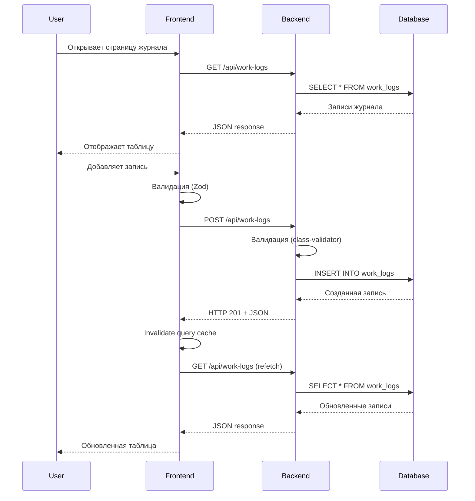
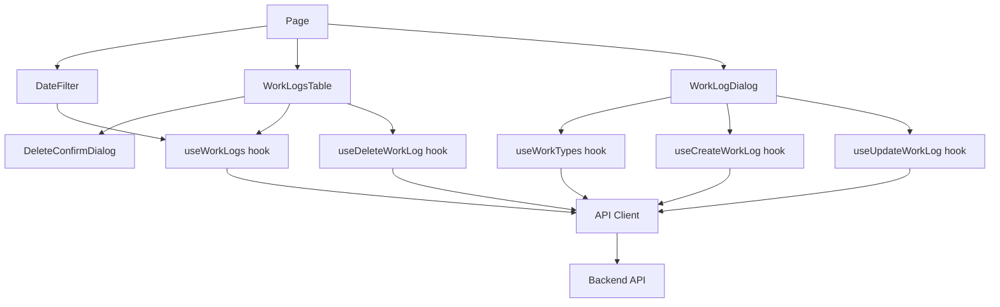

# Design Document: Журнал работ на строительном объекте

## Overview

Журнал работ на строительном объекте — это full-stack веб-приложение для управления записями о выполненных работах на строительных объектах. Система предоставляет CRUD-функциональность для записей журнала с поддержкой фильтрации, сортировки и пагинации.

### Ключевые возможности

- Просмотр списка выполненных работ в табличном формате
- Фильтрация записей по диапазону дат
- Сортировка по всем колонкам таблицы
- Добавление, редактирование и удаление записей
- Справочник видов работ с единицами измерения
- Валидация данных на клиенте и сервере
- Обработка ошибок с понятными сообщениями

### Технологический стек

**Frontend:**

- Next.js 14+ (App Router)
- TypeScript (strict mode)
- Tailwind CSS
- Shadcn/ui компоненты
- TanStack Query (серверное состояние)
- TanStack Table (таблица с сортировкой)
- react-hook-form + Zod (формы и валидация)

**Backend:**

- NestJS
- Prisma ORM
- PostgreSQL
- class-validator (валидация DTO)
- TypeScript (strict mode)

**Infrastructure:**

- Docker Compose (postgres, backend, frontend)
- CORS для взаимодействия frontend ↔ backend

## Architecture

### Общая архитектура

Приложение построено по архитектуре монорепозитория с разделением на frontend и backend:

```
BuildPulse/
├── frontend/          # Next.js приложение
│   ├── app/          # App Router страницы
│   ├── components/   # React компоненты
│   ├── lib/          # Утилиты, API клиент, Zod схемы
│   └── hooks/        # Custom React hooks
├── backend/          # NestJS приложение
│   ├── src/
│   │   ├── work-types/    # Модуль справочника видов работ
│   │   ├── work-logs/     # Модуль записей журнала
│   │   └── prisma/        # Prisma сервис
│   └── prisma/
│       ├── schema.prisma  # Схема БД
│       └── seed.ts        # Seed данные
└── docker-compose.yml
```

### Архитектурные слои

**Presentation Layer (Frontend):**

- Next.js App Router для роутинга
- React компоненты для UI
- TanStack Query для управления серверным состоянием
- react-hook-form для управления формами

**API Layer (Backend):**

- NestJS контроллеры для обработки HTTP запросов
- DTO для валидации входящих данных
- Exception filters для обработки ошибок

**Business Logic Layer (Backend):**

- NestJS сервисы для бизнес-логики
- Валидация бизнес-правил
- Трансформация данных

**Data Access Layer (Backend):**

- Prisma ORM для работы с БД
- Repository pattern через Prisma Client
- Миграции и seed данных

**Data Layer:**

- PostgreSQL для персистентности
- Две основные таблицы: work_types, work_logs
- Ссылочная целостность через foreign keys

### Поток данных



### Принципы проектирования

1. **Separation of Concerns**: Четкое разделение frontend/backend, presentation/business logic/data access
2. **Single Responsibility**: Каждый модуль/компонент отвечает за одну область функциональности
3. **DRY (Don't Repeat Yourself)**: Переиспользование компонентов, утилит, типов
4. **Type Safety**: TypeScript strict mode на всех слоях
5. **Validation at Boundaries**: Валидация на входе (frontend forms, backend DTOs)
6. **Error Handling**: Централизованная обработка ошибок с понятными сообщениями
7. **RESTful API**: Стандартные HTTP методы и статус-коды

## Components and Interfaces

### Backend Components

#### 1. WorkTypesModule

**Ответственность**: Управление справочником видов работ

**Компоненты:**

- `WorkTypesController`: HTTP endpoints для получения видов работ
- `WorkTypesService`: Бизнес-логика для работы со справочником
- `WorkType` (Prisma model): Модель данных

**Endpoints:**

```typescript
GET /api/work-types
Response: WorkType[]
```

**WorkType Interface:**

```typescript
interface WorkType {
	id: string // UUID
	name: string // "Кладка перегородок"
	unit: string // "м³"
	createdAt: Date
	updatedAt: Date
}
```

#### 2. WorkLogsModule

**Ответственность**: Управление записями журнала работ

**Компоненты:**

- `WorkLogsController`: HTTP endpoints для CRUD операций
- `WorkLogsService`: Бизнес-логика для работы с записями
- `CreateWorkLogDto`: DTO для создания записи
- `UpdateWorkLogDto`: DTO для обновления записи
- `QueryWorkLogDto`: DTO для фильтрации и пагинации
- `WorkLog` (Prisma model): Модель данных

**Endpoints:**

```typescript
GET /api/work-logs?dateFrom=&dateTo=&sortField=&sortOrder=&page=&limit=
POST /api/work-logs
PATCH /api/work-logs/:id
DELETE /api/work-logs/:id
```

**WorkLog Interface:**

```typescript
interface WorkLog {
	id: string // UUID
	date: Date // Дата выполнения
	workTypeId: string // FK → WorkType
	workType?: WorkType // Вложенный объект (при запросах)
	volume: number // Decimal(10,2)
	executorName: string // ФИО исполнителя
	createdAt: Date
	updatedAt: Date
}
```

**DTOs:**

```typescript
// CreateWorkLogDto
class CreateWorkLogDto {
	@IsDateString()
	@IsNotEmpty()
	@MaxDate(new Date()) // Не позже текущей даты
	date: string // YYYY-MM-DD

	@IsUUID()
	@IsNotEmpty()
	workTypeId: string

	@IsNumber()
	@IsPositive()
	@IsNotEmpty()
	volume: number

	@IsString()
	@Length(3, 100)
	@IsNotEmpty()
	executorName: string
}

// UpdateWorkLogDto (идентичен CreateWorkLogDto)
class UpdateWorkLogDto extends CreateWorkLogDto {}

// QueryWorkLogDto
class QueryWorkLogDto {
	@IsOptional()
	@IsDateString()
	dateFrom?: string // YYYY-MM-DD

	@IsOptional()
	@IsDateString()
	dateTo?: string // YYYY-MM-DD

	@IsOptional()
	@IsIn(['date', 'workType', 'volume', 'executorName'])
	sortField?: string

	@IsOptional()
	@IsIn(['asc', 'desc'])
	sortOrder?: 'asc' | 'desc'

	@IsOptional()
	@IsInt()
	@Min(1)
	page?: number // default: 1

	@IsOptional()
	@IsInt()
	@Min(1)
	@Max(100)
	limit?: number // default: 20
}
```

**Response Interfaces:**

```typescript
// GET /api/work-logs response
interface WorkLogsResponse {
	data: WorkLog[] // Массив записей с вложенным workType
	total: number // Общее количество записей
	page: number // Текущая страница
	limit: number // Размер страницы
}

// Error response (HTTP 400)
interface ValidationErrorResponse {
	message: string
	errors: {
		[field: string]: string[]
	}
}

// Error response (HTTP 404, 500)
interface ErrorResponse {
	message: string
	statusCode: number
}
```

#### 3. PrismaModule

**Ответственность**: Предоставление Prisma Client для работы с БД

**Компоненты:**

- `PrismaService`: Singleton сервис с Prisma Client
- Lifecycle hooks для подключения/отключения от БД

### Frontend Components

#### 1. Page Component (`app/page.tsx`)

**Ответственность**: Главная страница приложения

**Состав:**

- Layout с заголовком
- Кнопка "Добавить запись"
- Компонент фильтрации по датам
- Компонент таблицы записей

#### 2. WorkLogsTable Component

**Ответственность**: Отображение таблицы записей с сортировкой и пагинацией

**Props:**

```typescript
interface WorkLogsTableProps {
	dateFrom?: string
	dateTo?: string
}
```

**Функциональность:**

- Использует TanStack Table для рендеринга
- Поддерживает сортировку по всем колонкам
- Отображает визуальные индикаторы сортировки
- Показывает кнопки "Редактировать" и "Удалить" для каждой строки
- Отображает пагинацию (если записей > 20)
- Обрабатывает состояния: loading, error, empty

**Колонки:**

- Дата выполнения (формат ДД.ММ.ГГГГ)
- Вид работ
- Объём (с единицей измерения, 2 знака после запятой)
- ФИО исполнителя
- Действия (кнопки редактирования/удаления)

#### 3. DateFilter Component

**Ответственность**: Фильтрация записей по диапазону дат

**Props:**

```typescript
interface DateFilterProps {
	onFilter: (dateFrom?: string, dateTo?: string) => void
}
```

**Функциональность:**

- Два DatePicker поля: "Дата от" и "Дата до"
- Кнопка "Применить фильтр"
- Кнопка "Очистить фильтр"
- Валидация: дата "от" не может быть позже даты "до"
- Отображение ошибок валидации

#### 4. WorkLogDialog Component

**Ответственность**: Модальное окно для создания/редактирования записи

**Props:**

```typescript
interface WorkLogDialogProps {
	mode: 'create' | 'edit'
	workLog?: WorkLog // Для режима edit
	open: boolean
	onOpenChange: (open: boolean) => void
}
```

**Функциональность:**

- Форма с полями: date, workTypeId, volume, executorName
- Использует react-hook-form + Zod для валидации
- Загружает справочник видов работ (GET /api/work-types)
- Отображает единицу измерения при выборе вида работ
- Показывает индикатор загрузки при отправке
- Отключает кнопку "Сохранить" во время отправки
- Отображает ошибки валидации под полями
- Диалог подтверждения при закрытии с несохраненными изменениями

**Zod Schema:**

```typescript
const workLogSchema = z.object({
	date: z.string().refine((date) => new Date(date) <= new Date(), {
		message: 'Дата не может быть в будущем',
	}),
	workTypeId: z.string().uuid(),
	volume: z.number().positive({ message: 'Объём должен быть больше нуля' }),
	executorName: z
		.string()
		.min(3, { message: 'ФИО должно содержать от 3 до 100 символов' })
		.max(100, { message: 'ФИО должно содержать от 3 до 100 символов' }),
})
```

#### 5. DeleteConfirmDialog Component

**Ответственность**: Диалог подтверждения удаления записи

**Props:**

```typescript
interface DeleteConfirmDialogProps {
	open: boolean
	onOpenChange: (open: boolean) => void
	onConfirm: () => void
}
```

**Функциональность:**

- Отображает сообщение: "Вы уверены, что хотите удалить эту запись? Это действие нельзя отменить."
- Кнопки "Удалить" и "Отмена"

#### 6. API Client (`lib/api.ts`)

**Ответственность**: Централизованный клиент для HTTP запросов

**Функции:**

```typescript
// GET /api/work-types
async function getWorkTypes(): Promise<WorkType[]>

// GET /api/work-logs
async function getWorkLogs(params: QueryParams): Promise<WorkLogsResponse>

// POST /api/work-logs
async function createWorkLog(data: CreateWorkLogDto): Promise<WorkLog>

// PATCH /api/work-logs/:id
async function updateWorkLog(id: string, data: UpdateWorkLogDto): Promise<WorkLog>

// DELETE /api/work-logs/:id
async function deleteWorkLog(id: string): Promise<void>
```

**Error Handling:**

- Перехватывает HTTP ошибки
- Трансформирует в понятные сообщения
- Пробрасывает для обработки в компонентах

#### 7. TanStack Query Hooks (`hooks/useWorkLogs.ts`)

**Ответственность**: React hooks для работы с серверным состоянием

**Hooks:**

```typescript
// Получение списка записей
function useWorkLogs(params: QueryParams) {
	return useQuery({
		queryKey: ['work-logs', params],
		queryFn: () => getWorkLogs(params),
	})
}

// Получение справочника видов работ
function useWorkTypes() {
	return useQuery({
		queryKey: ['work-types'],
		queryFn: getWorkTypes,
	})
}

// Создание записи
function useCreateWorkLog() {
	const queryClient = useQueryClient()
	return useMutation({
		mutationFn: createWorkLog,
		onSuccess: () => {
			queryClient.invalidateQueries({ queryKey: ['work-logs'] })
		},
	})
}

// Обновление записи
function useUpdateWorkLog() {
	const queryClient = useQueryClient()
	return useMutation({
		mutationFn: ({ id, data }) => updateWorkLog(id, data),
		onSuccess: () => {
			queryClient.invalidateQueries({ queryKey: ['work-logs'] })
		},
	})
}

// Удаление записи
function useDeleteWorkLog() {
	const queryClient = useQueryClient()
	return useMutation({
		mutationFn: deleteWorkLog,
		onSuccess: () => {
			queryClient.invalidateQueries({ queryKey: ['work-logs'] })
		},
	})
}
```

### Взаимодействие компонентов



## Data Models

### Prisma Schema

```prisma
generator client {
  provider = "prisma-client-js"
}

datasource db {
  provider = "postgresql"
  url      = env("DATABASE_URL")
}

model WorkType {
  id        String   @id @default(uuid()) @db.Uuid
  name      String   @unique @db.VarChar(255)
  unit      String   @db.VarChar(50)
  createdAt DateTime @default(now()) @map("created_at")
  updatedAt DateTime @updatedAt @map("updated_at")

  workLogs  WorkLog[]

  @@map("work_types")
}

model WorkLog {
  id           String   @id @default(uuid()) @db.Uuid
  date         DateTime @db.Date
  workTypeId   String   @map("work_type_id") @db.Uuid
  volume       Decimal  @db.Decimal(10, 2)
  executorName String   @map("executor_name") @db.VarChar(100)
  createdAt    DateTime @default(now()) @map("created_at")
  updatedAt    DateTime @updatedAt @map("updated_at")

  workType     WorkType @relation(fields: [workTypeId], references: [id], onDelete: Restrict)

  @@map("work_logs")
}
```

### Таблица work_types

| Колонка    | Тип          | Ограничения             | Описание                 |
| ---------- | ------------ | ----------------------- | ------------------------ |
| id         | UUID         | PRIMARY KEY             | Уникальный идентификатор |
| name       | VARCHAR(255) | UNIQUE, NOT NULL        | Наименование вида работ  |
| unit       | VARCHAR(50)  | NOT NULL                | Единица измерения        |
| created_at | TIMESTAMP    | NOT NULL, DEFAULT NOW() | Дата создания            |
| updated_at | TIMESTAMP    | NOT NULL, DEFAULT NOW() | Дата обновления          |

**Seed данные:**

```typescript
const workTypes = [
	{ name: 'Кладка перегородок', unit: 'м³' },
	{ name: 'Монтаж опалубки', unit: 'м²' },
	{ name: 'Бетонирование', unit: 'м³' },
	{ name: 'Монтаж арматуры', unit: 'кг' },
	{ name: 'Отделочные работы', unit: 'м²' },
	{ name: 'Прочие работы', unit: 'шт' },
]
```

### Таблица work_logs

| Колонка       | Тип           | Ограничения             | Описание                 |
| ------------- | ------------- | ----------------------- | ------------------------ |
| id            | UUID          | PRIMARY KEY             | Уникальный идентификатор |
| date          | DATE          | NOT NULL                | Дата выполнения работ    |
| work_type_id  | UUID          | FOREIGN KEY, NOT NULL   | Ссылка на work_types.id  |
| volume        | DECIMAL(10,2) | NOT NULL                | Объём выполненных работ  |
| executor_name | VARCHAR(100)  | NOT NULL                | ФИО исполнителя          |
| created_at    | TIMESTAMP     | NOT NULL, DEFAULT NOW() | Дата создания записи     |
| updated_at    | TIMESTAMP     | NOT NULL, DEFAULT NOW() | Дата обновления записи   |

**Индексы:**

- PRIMARY KEY на id
- FOREIGN KEY на work_type_id → work_types.id (ON DELETE RESTRICT)
- INDEX на date (для оптимизации фильтрации)

**Ссылочная целостность:**

- При попытке удалить WorkType, на который ссылаются WorkLog записи, операция будет отклонена (ON DELETE RESTRICT)
- Это гарантирует, что все записи журнала всегда имеют валидный вид работ

### TypeScript типы

**Shared Types (используются на frontend и backend):**

```typescript
// Базовые типы
type UUID = string
type ISODateString = string // YYYY-MM-DD

// WorkType
interface WorkType {
	id: UUID
	name: string
	unit: string
	createdAt: Date
	updatedAt: Date
}

// WorkLog
interface WorkLog {
	id: UUID
	date: Date
	workTypeId: UUID
	workType?: WorkType // Опционально, включается при запросах
	volume: number
	executorName: string
	createdAt: Date
	updatedAt: Date
}

// API Request/Response types
interface CreateWorkLogRequest {
	date: ISODateString
	workTypeId: UUID
	volume: number
	executorName: string
}

interface UpdateWorkLogRequest extends CreateWorkLogRequest {}

interface QueryWorkLogsParams {
	dateFrom?: ISODateString
	dateTo?: ISODateString
	sortField?: 'date' | 'workType' | 'volume' | 'executorName'
	sortOrder?: 'asc' | 'desc'
	page?: number
	limit?: number
}

interface WorkLogsResponse {
	data: WorkLog[]
	total: number
	page: number
	limit: number
}
```

### Валидация данных

**Backend (class-validator):**

- date: обязателен, формат ISO 8601 (YYYY-MM-DD), не позже текущей даты
- workTypeId: обязателен, формат UUID, существует в таблице work_types
- volume: обязателен, число > 0
- executorName: обязателен, строка от 3 до 100 символов

**Frontend (Zod):**

- Идентичные правила валидации
- Дополнительная валидация в DateFilter: dateFrom <= dateTo

**Сообщения об ошибках:**

- "Это поле обязательно" (пустое обязательное поле)
- "Дата не может быть в будущем" (date > today)
- "Объём должен быть больше нуля" (volume <= 0)
- "ФИО должно содержать от 3 до 100 символов" (executorName length)
- "Вид работ не найден" (workTypeId не существует)
- "Дата начала не может быть позже даты окончания" (dateFrom > dateTo)
